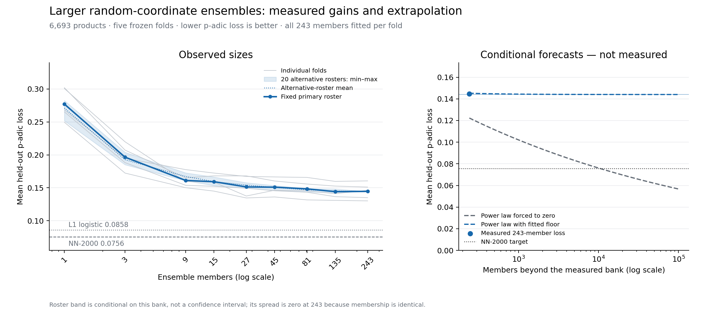
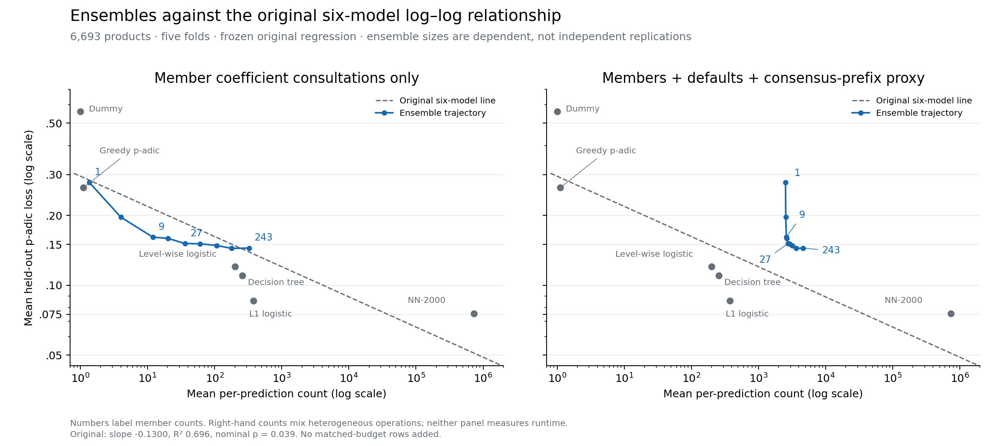

# Larger ensemble results, 10 September 2026

The improvement saturates. Increasing the random-coordinate ensemble from
nine to 243 members reduces mean held-out p-adic loss by **10.30%**, from
**0.161197 to 0.144596**. The 135-member result is slightly better, at 0.144178.
The extended curve does not support a credible forecast of reaching the
width-2,000 neural network's 0.075559 loss just by adding more of these members.

The largest ensemble is close to the original log-log line under the member-
coefficient counter: its loss is **3.90% above** the line's prediction. Adding
that configuration to the original six retains the nominal association
(p=0.01955). A broader consensus-work proxy moves it further above the line,
but the corresponding nominal p-value remains 0.02686. These conclusions
depend on the counter and configuration roster; they are not a universal
scaling law.

Assessment: **share with caveats**. All planned computations and independent
checks passed. This is an exploratory extension on the same five frozen
folds, not a new independent test population. The manuscript, its original
six-model regression, production models and frozen release were not changed.

## Observed size curve



Every row is the equal-weight mean of five folds. Sizes use nested prefixes
of the seed roster fixed in the [protocol](../ensemble-scaling-protocol.md),
without held-out selection of members or voting weights. The one-member row
is the original seed-42 model with valid-training-path projection, not the
average of every single-member fit.

| Members | Mean loss | Root accuracy | Exact-path accuracy | Member terms consulted per prediction | Stored nonzero member coefficients |
|---:|---:|---:|---:|---:|---:|
| 1 | 0.277064 | 72.40% | 47.26% | 1.36 | 733.6 |
| 3 | 0.196485 | 80.46% | 52.45% | 4.01 | 2,162.6 |
| 9 | 0.161197 | 83.99% | 55.50% | 12.02 | 6,488.2 |
| 15 | 0.159282 | 84.18% | 55.81% | 20.08 | 10,848.0 |
| 27 | 0.151346 | 84.98% | 56.63% | 36.08 | 19,551.2 |
| 45 | 0.150952 | 85.02% | 56.84% | 60.12 | 32,589.6 |
| 81 | 0.148368 | 85.27% | 56.99% | 107.92 | 58,609.2 |
| 135 | 0.144178 | 85.69% | 57.18% | 180.28 | 97,826.0 |
| 243 | 0.144596 | 85.65% | 57.52% | 324.76 | 176,087.2 |

Moving from 135 to 243 improves loss in three folds and worsens it in two;
the equal-fold mean worsens by 0.000418. The extra members slightly improve
exact-path accuracy even though root accuracy and the primary loss worsen.
This is not evidence that 135 is an independently selected optimal size.

Twenty alternative fixed roster permutations give the same flattening
pattern. Their mean losses at 9, 27, 81 and 135 members are 0.167202,
0.154209, 0.146905 and 0.145304. At 135 members their five-fold means range
from 0.142680 to 0.148303. At 243 every roster contains exactly the same bank,
so all predictions agree. The zero roster spread there does **not** mean
zero uncertainty about generalisation or a newly fitted bank. The plotted
range is conditional roster sensitivity, not a confidence interval.

The 243-member result still has higher loss than all four primary Euclidean
comparators in every fold:

| Comparator | Mean loss | Largest ensemble / comparator loss |
|---|---:|---:|
| NN-2000 | 0.075559 | 1.914 |
| L1 logistic regression | 0.085839 | 1.685 |
| Decision tree | 0.110314 | 1.311 |
| Level-wise logistic regression | 0.120450 | 1.200 |

Here “state of the art” means the best comparator measured in this paper,
not the best possible classifier in the wider literature. The neural result
is the original width-2,000, 12-thread reference, not its single-thread
diagnostic. Release checksums and fold denominators were checked before
comparison.

## Can a larger ensemble reach the neural network?

The full primary curve is well described by the **descriptive**, fitted-floor
model

`L(m) = 0.144026 + 0.133088 m^(-0.858592)`.

Its fitted floor is above both the neural and logistic targets, so this model
has no finite crossing of either target. Fitting the alternative-roster mean
gives a similar floor, 0.144320. Omitting one fold at a time gives primary
fitted floors from 0.139399 to 0.147486, still above both targets. These are
sensitivity ranges, not confidence intervals or proven achievable minima.

A power curve forced towards zero gives an apparent neural crossing around
10,589 members, but it fits poorly: loss-scale RMSE 0.018037 versus 0.001618
for the fitted-floor curve. Its forecast is also unstable: the apparent
crossing was 145 members when fitted to 1/3/9, and 4,652 when fitted through
135. The observed 243-member result contradicts the early optimistic forecast.

The predeclared size-axis check is more informative than training fit alone:

| Curve fitted only through 135 members | Predicted 243-member loss | Actual loss | Actual minus predicted |
|---|---:|---:|---:|
| Power law forced to zero | 0.115088 | 0.144596 | +0.029509 |
| Power law with fitted floor | 0.145453 | 0.144596 | -0.000856 |

This check withholds an ensemble size, not new products: all folds are still
the same dataset. The early three-parameter floor curve interpolates its
three points and has no residual degrees of freedom; that early exact fit
is not evidence by itself. The extended evidence supports saturation, but
does not prove an absolute limit for every larger bank or another member
algorithm. There is no defensible “we should catch the neural network at N
members” estimate from these results.

## Position on the log-log chart



The original relationship is
`log10(loss) = -0.529867 - 0.130041 log10(active support)`, with R²=0.696481
and nominal p=0.038794 across six configurations.

Two counters are shown explicitly:

1. **Member coefficients only:** sum each member's nonzero coefficient
   consultations. This follows the original greedy counter's convention,
   which excludes the zero-score default. Nine members are 24.55% below the
   frozen line; 243 members are only 3.90% above it.
2. **Broader scoring proxy:** add default uses, seven prefix checks per
   candidate path and seven prefix observations per member. At 243 this is
   4,585.71, versus 324.76 member terms alone. The observed loss is 46.61%
   above the line under this convention. These are heterogeneous operations,
   not interchangeable coefficient units or measured runtime; sorting and
   other implementation costs are not exhaustively counted.

The following are separate, one-at-a-time additions to the original six:

| Added configuration and counter | Points | Slope | R² | Nominal p |
|---|---:|---:|---:|---:|
| None: original line | 6 | -0.130041 | 0.696481 | 0.038794 |
| 9 members, coefficients only | 7 | -0.125188 | 0.674918 | 0.023416 |
| 243 members, coefficients only | 7 | -0.129850 | 0.696325 | 0.019546 |
| 9 members, broader proxy | 7 | -0.122291 | 0.649143 | 0.028701 |
| 243 members, broader proxy | 7 | -0.121698 | 0.657714 | 0.026865 |
| 1-member projection control, broader proxy | 7 | -0.112454 | 0.498002 | 0.076438 |

Thus the larger ensembles do not remove the nominal association. Every
multi-member size retains p<0.05 in its separate addition under either
counter. There is a relevant exception: the one-member projected control
with the broader proxy does cross 0.05. It incurs the candidate-path search
without a multi-member accuracy gain, and lies 2.60 times above the line.
This makes counter dependence material, even though the largest ensemble
does not break the relationship.

Mechanically adding all nine sizes gives R²=0.688229 and p=0.000130 for
member-only counts, or R²=0.446505 and p=0.006471 for the broader proxy.
Those p-values are **not valid independent-observation evidence**: the sizes
are nested, correlated configurations from one family. The original and
one-at-a-time statistics are themselves nominal configuration-level OLS on
one dataset, not evidence of a universal law. The flattening within this
family is a reason not to extrapolate the cross-model line indefinitely.
No parameter-budget-matched rows were added to any of these regressions.

## Validation, provenance and reproduction

All 1,170 new fits reached a complete no-improvement sweep. Together with
the 45 previously validated members, the bank contains 1,215 fits. New fitting
ran from 06:07:32 to 06:33:07 AEST on 10 September on raksasa, using four
single-threaded workers: 25.58 minutes of wall time and 4,834.62 summed job
seconds. The 243-member banks average 791.43 summed fitting seconds per fold;
these are shared-host observations, not portable speed claims.

Independent Python-integer reconstruction checked 6,505,596 training and
1,626,399 held-out predictions, plus 3,088,287 supported coordinates. All
60,237 primary consensus outputs matched the separate prefix implementation;
the old 1/3/9 predictions were reproduced exactly. All 945 size/fold/roster
evaluations completed, and all full-bank roster permutations agreed.

A further prefix-agreement histogram implementation independently checked
the loss, exact accuracy and root accuracy for 5,805 score sets: 16,263,990
raw/default-adjusted model prediction scores and 1,264,977 ensemble prediction
scores. Every comparison passed. Python 3.11.11 and NumPy 2.2.5 matched across
new and reused fits. Local tests: **227 passed, 6 skipped**; the skipped tests
require a separate test database. The suite was not pointed at production.

Private coefficients and row-aligned predictions remain in Shopify Postgres.
New checks, ensemble rows, metric audit and aggregate analysis use separate
batch records in the `padjective` schema and `pg_default`; earlier experiment
rows were preserved. The [aggregate result record](results.json),
[metric audit](metric-audit.json) and [analysis record](analysis.json) contain
metrics, costs, identifiers, hashes, sensitivity fits and source provenance,
not product titles, feature names or private row predictions.

- Batch: `059d7eb8-14b5-4d5d-857f-134a2098fd89`.
- Snapshot: `244ddbe3-0a2c-4c04-9436-0a0253108a09`.
- Snapshot digest: `039175941ed2a2ec888bc6c7314c3c5f8afac1201ff604413dedb55641706222`.
- Fitting source: `dc0ed30a83d667c5b12a55e241e4822ff3f19ec7`.
- Validator source: `ef08938` (full hash in the aggregate record).
- Independent metric audit: `ab40da3c9fbe5c38f7f7f02e42c9ae445cc13b0b`.
- Aggregate SHA-256: `565d6b9180896080a3f6d84ab5671061942c0d70a8c2d8312edc099f2ad105e7`.

From the repository root, with the checksum-verified frozen aggregate
comparator files available:

```sh
uv run -m padjective.paper_ensemble_scaling_analysis --results docs/ensemble-scaling/results.json --output-directory docs/ensemble-scaling
uv run -m pytest -q
```

These commands do not refit models or alter the manuscript. All chart inputs
are also retained in `analysis.json`, permitting figure-only reproduction
without the original comparator bundle.
