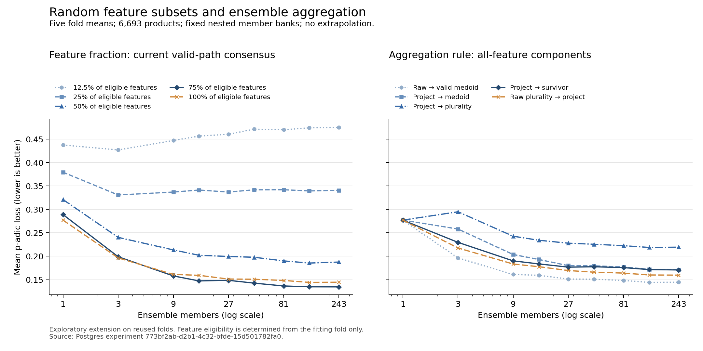
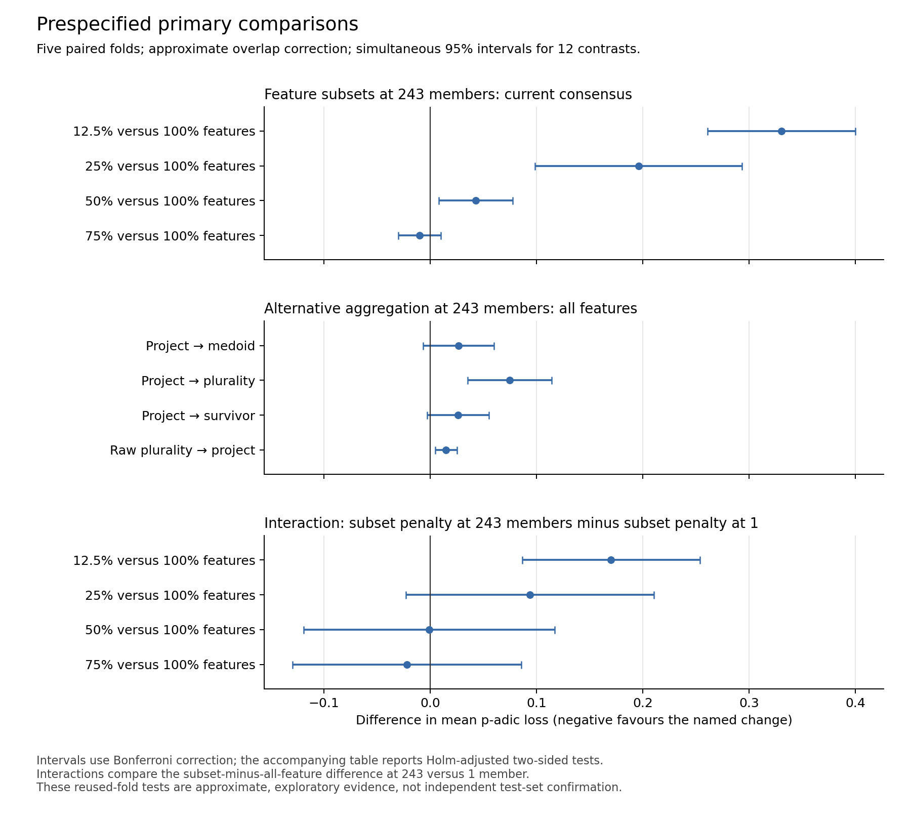

# Feature subsets and ensemble voting: results

11 September 2026. The 75%-feature ensemble is promising; the current p-adic
consensus remains the best aggregation rule tested. The apparent improvement
from feature masking needs confirmation on fresh data.

The manuscript includes this study and the earlier valid-path ablation
(papers revision `0d14259`). The methods, subset-size figure, aggregation
comparisons, statistical tests and representational proofs remain separate
from the original eight-configuration active-support regression.

**12 September manuscript update:** papers revision `b0b78a4` replaces Section
6.5's placeholder with three completed full labelled-catalogue comparisons
(31,038 / 31,138 / 31,238 products), all 2,430 certified components per run,
overlap/non-overlap and coverage subgroups, paired uncertainty and the two
unchanged-common-product refit comparisons. The latest equal-fold losses are
0.626790 (75%) and 0.634762 (100%); the difference's approximate 95% interval
is [-0.017379,+0.001435], p=0.07827. All three overall intervals include zero.
About 60% of products have no usable fitting-fold tags. These partially
overlapping store-grouped refits are not independent confirmation, frozen-model
drift measurements or replacements for the fixed-snapshot numbers below.

Public evidence and its read-only export/portable arithmetic checks are in
`papers/padjective/padic-journal/data/live-subspace-results.json`,
`export_live_subspace_evidence.py` and `generate_live_subspace_assets.py`.
Private product rows and predictions remain on raksasa. All 39 manuscript
asset tests and 269 Padjective tests pass (six skips). The rebuilt, visually
reviewed 34-page canonical PDF has SHA-256
`c90c7a7e5fbbd7dc92a80b4bad9a5e82188c1564add2aeca148e43ed60492011`.
No partial or smoke-test scores were inserted. The frozen 10 September release,
original log-log assets, fitting code, running service and reMarkable library
are unchanged by the manuscript update.

## Experiment and checks

The [protocol](subspace-voting-protocol.md) was fixed before any new subset fit
or held-out subset score was inspected. We fitted 4,860 new components and
reused 1,215 validated all-feature components. The grid contains five feature
fractions, nine ensemble sizes and five aggregation rules, with five fixed
folds over 6,693 products. Twenty alternative member rosters at sizes 9 and 81
provide conditional seed-bank sensitivity, not independent test replications.

All new components reached independently certified coordinate optima; none
hit a resource cap. New fitting took 1,799.77 seconds wall time using four
single-threaded workers. All 6,075 component read-backs and 6,125 evaluation
rows passed validation. All 45 original primary ensemble prediction hashes
matched, and every evaluation metric was checked with a second implementation.

[Vector PDF](results/subspace-voting-20260911/subspace-size-comparisons.pdf).
All displayed scores are equal-weight means of the five fold scores; they
are not pooled-product estimates. Lower p-adic loss is better.

## Feature subsets

At 243 members, using the current valid-candidate p-adic consensus:

| Features per component | Mean loss | Exact path accuracy | Root accuracy | Holm p versus all features |
|---|---:|---:|---:|---:|
| 12.5% | 0.475147 | 15.342% | 52.716% | 0.000117 |
| 25% | 0.340753 | 30.546% | 66.123% | 0.003043 |
| 50% | 0.187589 | 48.982% | 81.389% | 0.013165 |
| 75% | 0.134655 | 57.385% | 86.650% | 0.127466 |
| 100% | 0.144596 | 57.524% | 85.651% | Reference |

The 75% model reduced loss by 6.875%, improving in all five folds. Its
overlap-corrected two-sided p value before multiplicity correction was 0.04249,
but Holm correction over the 12 prespecified primary tests gave p=0.12747.
The pointwise 95% interval for the difference was [-0.019337,-0.000546]; the
Bonferroni simultaneous interval was [-0.029857,+0.009975]. This is suggestive
evidence, not a confirmed improvement at family-wise alpha=.05.

The gain is in hierarchical accuracy: root accuracy rises by about one
percentage point, while exact-path accuracy falls by 0.139 percentage points.
The 75% model therefore did not improve every measure.

At this size it used an average of 151,988 nonzero stored coefficients versus
176,087.2 for the all-feature ensemble, a 13.7% reduction. Mean active member
coefficient terms per prediction fell from 324.763 to 287.733, an 11.4%
reduction. These are member costs, excluding decoder work; they are not an
end-to-end timing result or additional observations for the original
active-support regression.

The nominal 75% masks contained 1,906 or 1,907 eligible features per member.
At 243 members, every fraction covered every eligible feature in every fold.
Even the poor 12.5% result therefore cannot be attributed to features missing
from the ensemble's entire feature union. Coverage by at least one component
was not sufficient for good performance.

### Interaction with ensemble size

Current consensus, by member count and feature fraction:

| Members | 12.5% | 25% | 50% | 75% | 100% |
|---:|---:|---:|---:|---:|---:|
| 1 | 0.437415 | 0.379334 | 0.320974 | 0.288919 | 0.277064 |
| 3 | 0.426884 | 0.330753 | 0.240285 | 0.198949 | 0.196485 |
| 9 | 0.447002 | 0.336983 | 0.213480 | 0.157997 | 0.161197 |
| 15 | 0.456409 | 0.341277 | 0.202086 | 0.147371 | 0.159282 |
| 27 | 0.460331 | 0.337025 | 0.199520 | 0.148627 | 0.151346 |
| 45 | 0.471161 | 0.341761 | 0.197829 | 0.142618 | 0.150952 |
| 81 | 0.469863 | 0.341938 | 0.190065 | 0.136581 | 0.148368 |
| 135 | 0.474018 | 0.339396 | 0.185442 | 0.134784 | 0.144178 |
| 243 | 0.475147 | 0.340753 | 0.187589 | 0.134655 | 0.144596 |

More members did not always help. The 12.5% ensemble became worse from one
to 243 members. The 25% version improved initially but remained far behind.
Their subset-minus-all-feature penalties increased significantly with ensemble
size under the prespecified endpoint interaction tests (Holm p=.003043 and
.045250). The corresponding interaction tests for 50% and 75% were not
significant (p=.965683 and .599575).

The best observed cell in the entire grid was 75%, 243 members, current
consensus. There was little further observed gain from 135 to 243 members
(0.134784 to 0.134655), but this does not establish an asymptotic limit.
None of the 216 secondary comparisons established a lower loss than the
all-feature reference at the same size after their separate Holm correction;
74 established higher loss.

The 75% result was not confined to the primary roster: it beat the all-feature
model in 17/20 alternative rosters at nine members and 20/20 at 81 members.
At 81, the roster-average loss was 0.136180 versus 0.146954. Those are repeated
selections from the same fitted banks on the same folds, not twenty new tests.

## Aggregation rules

All-feature components at 243 members:

| Rule | Mean loss | Exact path accuracy | Holm p versus current consensus |
|---|---:|---:|---:|
| Current valid-candidate p-adic consensus | 0.144596 | 57.524% | Reference |
| Project each member, then p-adic medoid | 0.171245 | 56.053% | 0.045250 |
| Project each member, then whole-path plurality | 0.219389 | 53.859% | 0.003360 |
| Project each member, then survivor voting | 0.170784 | 56.070% | 0.036210 |
| Raw-code plurality, then project the winner | 0.159666 | 56.657% | 0.007733 |

All four alternatives were worse in the primary comparison. Across the entire
grid, no alternative had lower mean p-adic loss than current consensus at the
same feature fraction and member count. All five rules agree for one member.
"Plurality" means most votes, not necessarily more than half the votes.

The survivor rule implements root plurality, filters to that root's voters,
compares stop against all continuing votes, and, if continuing wins, chooses
and filters to the next branch. Ties in stop-versus-continue choose stop. Its
voters are individually projected to fitting-fold paths so that they are
valid taxonomy paths; this projection is a separate part of the construction.

That distinction matters. Against the medoid of the *same projected voters*,
the survivor rule was not distinguishable by these tests at any fraction.
At 100%, its loss difference was -0.000462 with Holm p=1.0; at 75%, it was
-0.001039 with p=.7116, in the separate ten-comparison family. This is not
proof of equivalence. Whole-path plurality was worse than projected medoid
at all five fractions after that family's correction.

Thus the full difference between the survivor rule and current consensus
must not be attributed to the survivor decisions alone. Merely moving path
projection before consensus already increased loss from 0.144596 to 0.171245.

## Prespecified primary tests

[Vector PDF](results/subspace-voting-20260911/subspace-primary-contrasts.pdf).
The fold sizes are 1,300, 1,337, 1,348, 1,372 and 1,336. Tests use five paired
fold differences and the approximate Nadeau–Bengio-style overlap correction
specified in the protocol, with four degrees of freedom. Holm p values below
refer to one family of 12 two-sided tests. Intervals use the more conservative
Bonferroni correction, so an interval crossing zero need not agree with a
Holm rejection. Negative differences favour the named alternative; negative
interactions mean the subset penalty decreases as the ensemble grows.

| Contrast | Mean difference | Simultaneous 95% interval | Holm p |
|---|---:|---:|---:|
| 12.5% versus 100%, M243 | +0.330551 | [+0.260884, +0.400218] | 0.000117 |
| 25% versus 100%, M243 | +0.196157 | [+0.098853, +0.293461] | 0.003043 |
| 50% versus 100%, M243 | +0.042992 | [+0.008291, +0.077694] | 0.013165 |
| 75% versus 100%, M243 | -0.009941 | [-0.029857, +0.009975] | 0.127466 |
| Projected medoid versus current, M243 | +0.026649 | [-0.006719, +0.060016] | 0.045250 |
| Projected plurality versus current, M243 | +0.074792 | [+0.035173, +0.114411] | 0.003360 |
| Projected survivor versus current, M243 | +0.026187 | [-0.002822, +0.055196] | 0.036210 |
| Raw plurality then projection versus current, M243 | +0.015069 | [+0.004860, +0.025278] | 0.007733 |
| 12.5% interaction, M243 versus M1 | +0.170200 | [+0.086712, +0.253687] | 0.003043 |
| 25% interaction, M243 versus M1 | +0.093886 | [-0.022733, +0.210505] | 0.045250 |
| 50% interaction, M243 versus M1 | -0.000918 | [-0.118963, +0.117127] | 0.965683 |
| 75% interaction, M243 versus M1 | -0.021796 | [-0.129576, +0.085984] | 0.599575 |

This remains an exploratory extension on an extensively reused benchmark.
The correction is approximate for one five-fold partition, not a guarantee
of exact test calibration. Products, members and alternative rosters were
not treated as independent training-sample replications.

## Representation results

The [theory notes](subspace-voting-theory.md) give proofs and executable
counterexamples. The main results are:

- Masks cannot enlarge the unrestricted hypothesis class: omitted coefficients
  can already be set to zero. They can change fitting and generalisation.
- Voting can produce non-affine interactions across disjoint masks. Three
  singleton members can implement a majority function that is not affine.
- For two different-root labels, four of the rules have real polynomial
  threshold degree at most k when every member sees at most k features. They
  cannot represent parity on more than k features, regardless of ensemble size.
- Raw-code plurality followed by projection can escape that obstruction.
  Seven singleton/constant components implement XNOR with unique plurality
  winners. Projecting those components first makes the ensemble constant.
- A strict majority for one valid path forces medoid, plurality and survivor
  voting to agree. Without one, all three can return different paths.
- Constant-distance raw votes have no effect on current consensus, but early
  projection can turn them into arbitrary votes. This is a possible mechanism,
  not an established causal explanation of the observed degradation.

The notes also give feature-union/common-kernel invariance, coverage formulae,
a finite-precision capacity bound and a multiclass decision-region description.
These concern representability, not the optimiser's ability to find a function
or its generalisation. They are not claimed as novel; the threshold-degree
argument uses a standard framework cited in the notes.

## Recommendation and provenance

Keep the current aggregation rule. The 75%-feature ensemble is the candidate
worth confirming on fresh data; retain it as an exploratory result until then.
The projection-order and representation results are worth discussing, with
the binary/multiclass and fitting/generalisation boundaries kept explicit.

[Complete aggregate evidence](results/subspace-voting-20260911/results.json),
[reproduction instructions](subspace-voting-reproduction.md), and
[figure contract](subspace-figure-contract.md).

Batch: `773bf2ab-d2b1-4c32-bfde-15d501782fa0`.
Training source: `2ca78551e5a7a2f3ecae4fb29929a2b6274398f0`.
Evaluator source: `050104c2f7623348bb40878a36b9cb232f2fcf09`.
Aggregate SHA-256:
`0bb9c4cb5141850df87ed8bb9d8e610c2739b03de11db405c3b012158ea8cde9`.
Private predictions and fitting evidence remain in Shopify Postgres under
`padjective.paper_subspace_*`; the exported JSON contains aggregate evidence.
