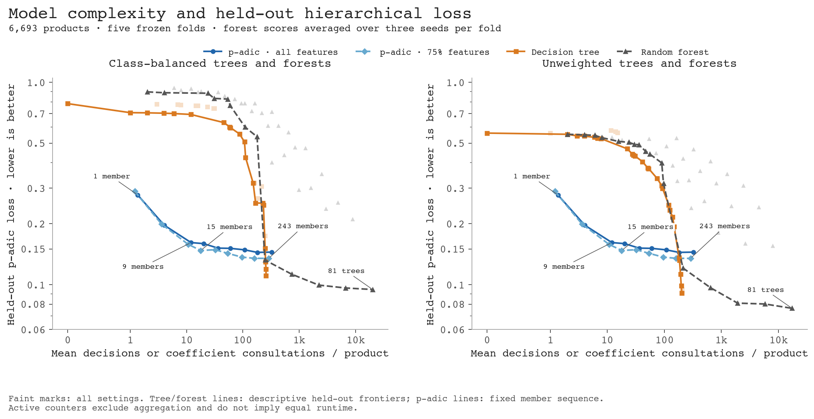
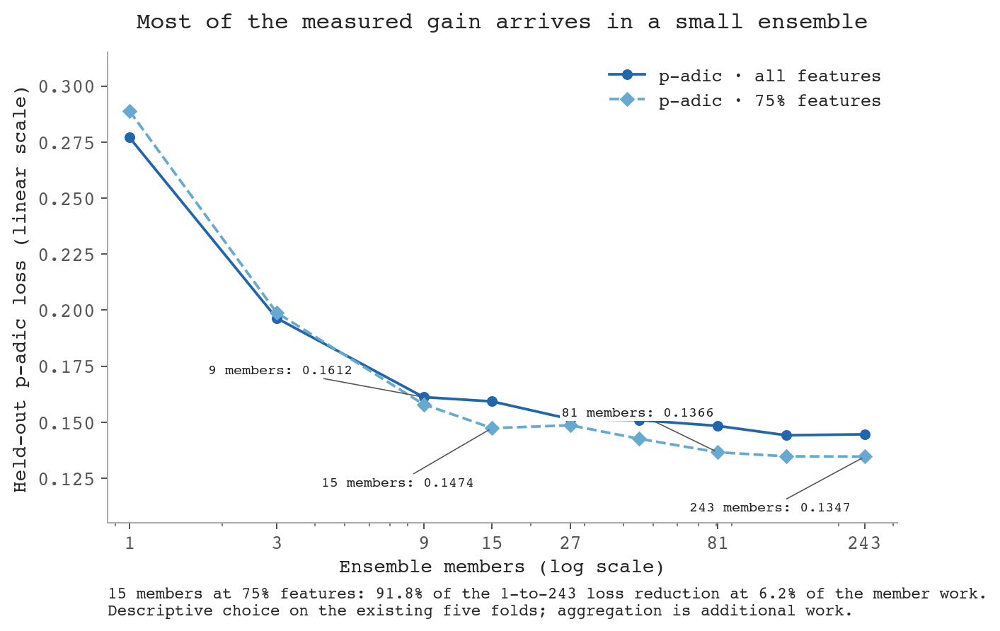
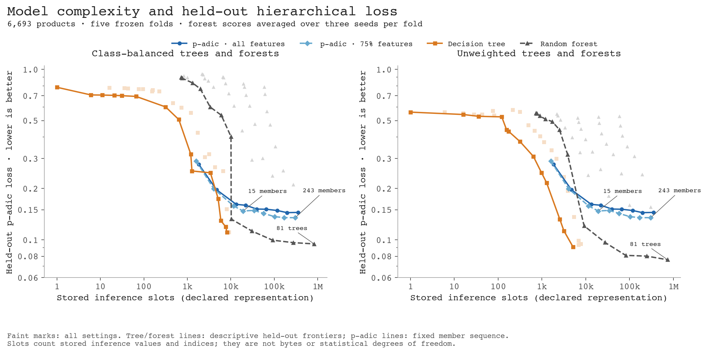

# P-adic ensembles, decision trees and random forests

22 September 2026. Experiment and review note. The journal manuscript now includes
this as a separate capacity comparison, with annotated vector figures.

**There is a substantial range in which the p-adic ensembles achieve better
accuracy with fewer active member terms than the tested trees and forests.
That advantage depends on what we count. It does not establish smaller stored
models or cheaper complete predictions.** The largest ensembles still lose to
the stronger classical models. At the high-accuracy end, the random forest
outperforms the decision tree in this experiment.

## What was compared

The new experiment uses the paper's exact Postgres snapshot: 6,693 products,
2,542 binary tag features, 363 taxonomy paths and the same five folds. Each
fit uses four folds and predicts the remaining fold. We reused and rechecked
the existing all-feature and 75%-feature p-adic ensembles, with 1, 3, 9, 15,
27, 45, 81, 135 and 243 members, fixed member ordering and the existing
valid-path p-adic consensus rule.

The new classical grid contains:

- Decision trees with 19 depth settings (1 through 512, then unlimited),
  10 leaf-count limits (2 through 1,024), and 11 post-pruning strengths.
- Random forests with eight depth settings (2 through 128, then unlimited),
  nested prefixes of 1, 3, 9, 27 and 81 trees, and three fixed random seeds.
- Both the paper's balanced class weights and ordinary unweighted fitting.
  The latter is a useful control because the reported loss is unweighted.

These are Gini classifiers. The forests bootstrap products, sample the square
root of the feature count at each split, and average leaf probabilities. A
one-tree forest is therefore a randomised bootstrap tree, not the deterministic
decision-tree baseline. Pruning and forest behaviour follow the
[sklearn tree](https://scikit-learn.org/stable/modules/tree.html#minimal-cost-complexity-pruning)
and [random-forest](https://scikit-learn.org/stable/modules/generated/sklearn.ensemble.RandomForestClassifier.html)
implementations; the actual runtime was sklearn 1.6.1. The full grid and
counting rules were fixed in the [protocol](../tree-ensemble-tradeoff-protocol.md)
before the new fits.

There are 80 tree configurations, 80 forest configurations after averaging
the three seeds, and 18 p-adic configurations. Forest scores are first averaged
within each fold, then across the five folds. All other means give each fold
equal weight too. The forest seed average describes repeated fitted forests;
it is not a single ensemble combining those seeds.

## The comparison that answers the original question

The paper's **258.35** and **324.76** are respectively branch decisions and
nonzero member-coefficient consultations per prediction. They are not total
stored parameter counts. On that existing active-work convention, the curves
show an early advantage for p-adic ensembles and a later crossover.



[The same comparison with linear loss](loss-vs-work-linear.pdf) makes absolute
improvements easier to compare. Selected points now show ensemble member counts
or forest tree counts; the 15-member, 75%-feature point is highlighted.

Lower loss is better. The loss axis is logarithmic; the work axis is logarithmic
above 1 and linear from 0 to 1. Faint points show every configuration. Classical
lines join the observed lower-loss frontier; the p-adic lines retain the fixed
member-size sequence, including its small reversals. Connecting segments do
not represent additional fitted models.

Here is the best observed loss available within several mean active-work
budgets. The classical columns use unweighted fits, which provide stronger
comparators than the paper's class-balanced models in this study.

| Mean active-work ceiling | All-feature p-adic | 75%-feature p-adic | Decision tree | Random forest |
|---:|---:|---:|---:|---:|
| 10 | 0.196485 | 0.198949 | 0.525845 | 0.532483 |
| 30 | 0.159282 | 0.147371 | 0.434789 | 0.493108 |
| 100 | 0.150952 | 0.136581 | 0.298135 | 0.315573 |
| 300 | 0.144178 | 0.134655 | 0.090718 | 0.120642 |
| 3,000 | 0.144178 | 0.134655 | 0.090718 | 0.080913 |

These are **descriptive budget winners chosen from the measured grid**, not
scores from a separate hyperparameter-selection and final-test procedure.
The complete configuration identities are retained in [analysis.json](analysis.json).

The nine-member all-feature ensemble reaches loss **0.161197** with **12.02**
coefficient consultations per product. Every tested tree or forest within that
active-work budget has loss above 0.52. At roughly 100 active terms, the
75%-feature ensemble with 81 members reaches **0.136581**, versus **0.298135**
for the unweighted depth-128 tree and **0.315573** for the one-tree depth-128
forest. The p-adic loss is lower in all five folds for these fixed settings;
the forest comparison uses the within-fold seed mean.

The first measured unweighted tree to overtake the best affordable all-feature
p-adic ensemble has maximum depth 384: **181.13** decisions and loss **0.135928**.
The previous tree frontier point has 148.26 decisions and loss 0.193475.
For the 75%-feature ensemble, the first overtaking tree instead has a 512-leaf
limit: **184.63** decisions and loss **0.131817**, following the depth-384 point.
The first overtaking unweighted forest is the unrestricted one-tree forest:
**212.25** decisions and loss **0.120642**. Its previous frontier point is the
depth-128 one-tree forest, at 96.58 decisions and loss 0.315573. These are
measured brackets, not precise continuous crossover estimates. Unmeasured
settings could change them. With balanced weights the corresponding first
overtaking settings occur later: about 252.65 tree decisions or 247.03 forest
decisions.

## Accuracy and the high-capacity end

### A useful small-ensemble compromise

The **15-member ensemble with 75% of features per member** is a useful point
to highlight: **0.147371 loss, 85.38% root accuracy and 56.06% exact-path
accuracy**, at **17.86 coefficient consultations per product**.
It achieves **91.8% of the loss reduction from one to 243 members** in that
same feature-subset series, with **6.2% of the 243-member model's active member
work**. These percentages describe loss reduction and member work, respectively;
they are not percentages of maximum achievable accuracy or complete runtime.

At that work ceiling the best measured unweighted tree and forest have losses
0.525845 and 0.509827. Going from 15 to 243 members reduces p-adic loss by
another 0.012716 and increases root and exact-path accuracy by 1.27 and
1.33 percentage points, while multiplying member work by 16.1.
Nine all-feature members remain a simpler alternative at 12.02 consultations
and 83.99% root accuracy.



The 15-member choice is **illustrative and made after inspecting these results**.
It is not a prespecified elbow criterion, an independently validated optimum,
or a significant win for the 75% feature mask. The original multiple-testing
qualification still applies. Its declared storage is 19,151.2 slots, and it
still requires consensus; the low member count does not establish a smaller
stored model or faster full prediction.

| Configuration | Mean active work | p-adic loss | Root accuracy | Exact-path accuracy | Stored slots |
|---|---:|---:|---:|---:|---:|
| p-adic, all features, 9 members | 12.02 | 0.161197 | 83.99% | 55.50% | 13,346 |
| p-adic, 75% features, 15 members | 17.86 | 0.147371 | 85.38% | 56.06% | 19,151 |
| p-adic, 75% features, 81 members | 96.41 | 0.136581 | 86.46% | 57.23% | 101,995 |
| p-adic, all features, 243 members | 324.76 | 0.144596 | 85.65% | 57.52% | 352,778 |
| p-adic, 75% features, 243 members | 287.73 | 0.134655 | 86.65% | 57.39% | 304,580 |
| Paper tree: balanced, unpruned | 258.35 | 0.110314 | 89.07% | 60.93% | 9,105 |
| Unweighted tree, at most 1,024 leaves | 202.92 | 0.090718 | 91.02% | 65.08% | 5,116 |
| Unweighted forest, 81 unrestricted trees | 17,328.93 | 0.076288 | 92.45% | 67.42% | 736,261 |

The 1,024-leaf tree and 81-tree forest are the lowest-loss configurations
observed in their respective families, not independently validated optima.
An unweighted nine-tree unrestricted forest already reaches loss 0.080913 at
1,930.29 decisions, beating every tested single-tree configuration on mean loss.
Thus the final ordering is not simply “the decision tree wins at saturation”.
The strongest forest buys additional accuracy with considerably more work.

For the all-feature p-adic ensemble, multiplying the nine-member work by about
27 reduces loss by only 10.3%, from 0.161197 to 0.144596. The 75%-feature variant
is better at larger sizes, but its improvement from 81 to 243 members is only
0.001926 absolute loss. Both curves show diminishing returns.

[Root and exact-path accuracy graph](accuracy-vs-work.png) ·
[Tree depth, training and held-out loss](tree-depth.png) ·
[Individual fold comparisons](fold-comparisons.png)

Root accuracy and exact-path accuracy tell different stories. With p=71,
a root error costs 1 while an error first appearing at the next level costs
1/71. The primary loss is therefore driven mostly by root errors; exact-path
accuracy remains useful for assessing the complete label.

## The limitation that changes the interpretation

**Stored model size does not favour these p-adic ensembles.** Every one of the
18 p-adic configurations is beaten on mean loss by an unweighted tree with
fewer stored inference slots.



The declared representation counts four slots per internal tree node and one
class label per leaf. Forests retain two slots per nonzero leaf probability,
plus their split-node state and tree roots, because probability averaging
needs those distributions. P-adic models retain a feature index and value per
nonzero coefficient, one default per member, and the candidate-path codes.
Shared feature dictionaries and codebooks are excluded for every family.
These are logical scalar slots, not bytes, degrees of freedom or a claim of
minimal compression. The original tree parameter proxy is not substituted
into this chart.

The complete prediction also needs a decoder. The nine-member all-feature
ensemble's member-only count is 12.02, but a broader proxy that includes its
member-prefix observations and candidate-prefix checks is **at least 2,602.02**
per prediction. Its default handling adds at most another nine units. Under
this broader counter, the unweighted tree has both lower loss and lower cost
than every p-adic configuration. The corresponding
[broader-work graph](loss-vs-broader-work.png) deliberately uses the p-adic
lower bound, favouring the p-adic models. Exact default-use totals were not
recomputed for this follow-up; both lower and upper bounds are retained.

This remains heterogeneous operation bookkeeping, not a runtime benchmark.
The experiment supports a claim about the sparsity of the member calculation.
It does not demonstrate faster end-to-end inference or a shorter complete
human explanation once consensus is included.

## Interpretation in the paper

A defensible result would be: on the fixed sparse-product benchmark, small
p-adic ensembles achieve lower hierarchical loss than the tested trees and
forests at low budgets of active member-coefficient consultations versus
branch decisions. The advantage is substantial around 10–100 such terms per
prediction. Deeper trees overtake the ensembles, and larger forests achieve
the lowest measured loss. The crossover depends on class weighting and the
complexity definition; it does not extend to stored model size or establish
an end-to-end computational advantage.

The manuscript now includes a separate capacity–accuracy subsection, a selected
configuration table, log–log and linear-loss work panels, and stored-state and
broader-work panels. The abstract, introduction, methods, limitations, conclusion
and reproduction notes refer to the experiment where relevant. These deliberately
varied configurations remain separate from the paper's active-support regression.

## Scope, validation and reproduction

This is an exploratory extension on the same five folds already used for the
earlier ensemble studies. The 75% variant was included because of its previous
performance. No new independent dataset, nested hyperparameter selection or
post-selection significance test is claimed. The forest grid uses standard
sqrt-feature sampling; other forest settings, other p-adic member algorithms
or other datasets could move the curves. Folds share training data. Forest
seed ranges in the aggregate record measure seed sensitivity, not independent
replication, and the reused p-adic roster is held fixed.

All 640 new fit jobs completed: 400 single-tree fits and 240 forest banks of
81 trees. The resulting 1,600 classical fold/seed/size rows join 90 rechecked
p-adic rows. All **1,690 rows** passed Postgres read-back checks, with
**2,262,234 held-out prediction scores** checked by two p-adic metric
implementations. Sampled direct tree traversals agree with sklearn, and every
forest prefix reproduces sklearn's probability-average predictions. The
unpruned balanced tree reproduces the paper's five losses, mean work and
exact-path accuracy. Unit tests: **276 passed, 6 skipped**.

Private row-aligned predictions remain in new tables in the Shopify database's
`padjective` schema, with tables and indexes explicitly in `pg_default`.
This folder contains aggregate evidence only. The reviewed summary, analysis
and artifact hashes are also attached to the experiment's Postgres record.

- Experiment batch: `95b8a6bf-28b9-4a17-9ee6-58759d149ff5`.
- Snapshot: `244ddbe3-0a2c-4c04-9436-0a0253108a09`.
- Snapshot digest: `039175941ed2a2ec888bc6c7314c3c5f8afac1201ff604413dedb55641706222`.
- Fitting source: `b876b70`; Python 3.11.11, NumPy 2.2.5, sklearn 1.6.1.
- Reused subspace batch: `773bf2ab-d2b1-4c32-bfde-15d501782fa0`.
- [Raw aggregate results](results.json) and [derived analysis](analysis.json).

Recreate the figures locally from aggregate results:

```sh
uv run -m padjective.paper_tree_tradeoff_figures \
  --results docs/tree-ensemble-tradeoff/results.json \
  --output-directory docs/tree-ensemble-tradeoff
uv run -m pytest -q
```

To refit, run the following on the database host in an isolated checkout. It
creates a new batch and requires a new output path:

```sh
OPENBLAS_NUM_THREADS=1 OMP_NUM_THREADS=1 MKL_NUM_THREADS=1 \
  uv run --frozen -m padjective.paper_tree_ensemble_tradeoff \
  --workers 2 --output /path/to/new-results.json
```

All figures are available in PNG, SVG, vector PDF and EPS. Their repeated curve form
is deliberate: each examines an ordered capacity sweep, a different counting
convention, a different accuracy metric, or the same relationship across folds.

| Figure | Question | Fields and comparison |
|---|---|---|
| [Loss/work PDF](loss-vs-work.pdf) | Where is the low-work advantage? | Mean member/branch work versus p-adic loss; class-weight panels |
| [Loss/storage PDF](loss-vs-storage.pdf) | Does the advantage imply a smaller model? | Stored slots versus loss; same configurations |
| [Broader-work PDF](loss-vs-broader-work.pdf) | How does aggregation bookkeeping change the picture? | Broader work versus loss; p-adic lower bounds |
| [Accuracy PDF](accuracy-vs-work.pdf) | Is the full path correct, or only the root? | Active work versus the two accuracy metrics |
| [Depth PDF](tree-depth.pdf) | What changes as trees grow deeper? | Maximum depth versus training and held-out loss |
| [Folds PDF](fold-comparisons.pdf) | Is the shape driven by one fold? | Active work versus loss in all five folds |
| [Linear loss/work PDF](loss-vs-work-linear.pdf) | How large are absolute loss differences? | Same configurations and annotations, linear loss |
| [Linear loss/storage PDF](loss-vs-storage-linear.pdf) | Is there a storage advantage? | Same storage proxy, linear loss |
| [Linear broader-work PDF](loss-vs-broader-work-linear.pdf) | What does consensus add? | Same broader counter, linear loss |
| [Linear fold PDF](fold-comparisons-linear.pdf) | Do absolute gaps recur across folds? | Five-fold panels with linear loss |
| [Small-ensemble PDF](small-ensemble.pdf) | Where do returns begin to diminish? | Loss versus member count; the 15-member compromise |
| [Journal work PDF](tree_tradeoff_work.pdf) | What goes into the paper? | Annotated log–log and linear-loss panels, unweighted fits |
| [Journal costs PDF](tree_tradeoff_costs.pdf) | What qualifies the claim? | Stored slots and broader scoring proxy |

The [figure-format note](figure-formats.md) records the checked journal
instructions and earlier Sudoku EPS workflow. EPS files use embedded Courier
fonts (the portable fallback is URW's Courier equivalent, Nimbus Mono PS).
The source emits actual vector paths and text; PNGs are viewing copies.

Colours and markers consistently identify model families: blue circles for
all-feature p-adic ensembles, lighter blue diamonds for 75%-feature ensembles,
orange squares for trees and grey triangles for forests. All figures were
rendered and visually inspected before handoff.
